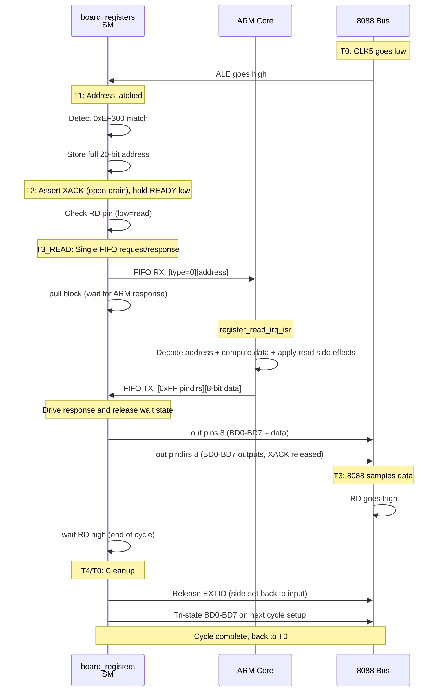
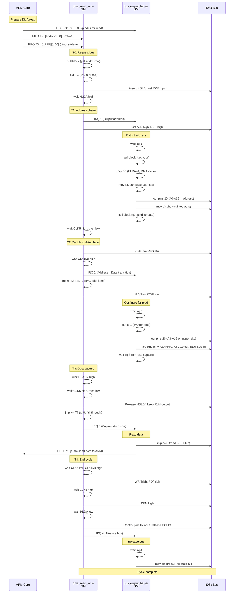
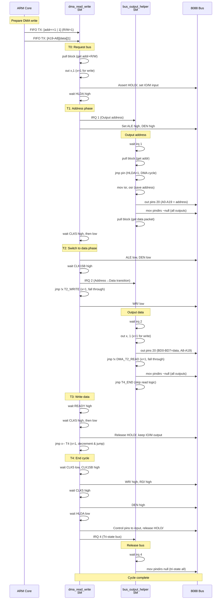

# PIO State Machine Coordination Diagrams

This document shows the T-state timing and signaling between the three PIO state machines for different bus cycles.

## Register Read Cycle (8088 reading from 0xEF300, single-pass)

## DMA Read Cycle (Pico reading from 8088 memory)

## DMA Write Cycle (Pico writing to 8088 memory)

## IRQ Protocol Summary

| IRQ | Source | Destination | Phase | Purpose |
|-----|--------|-------------|-------|---------|
| **1** | dma_read_write | bus_output_helper | T1 | Output DMA address phase |
| **2** | dma_read_write | bus_output_helper | T2 | Switch from address to data phase |
| **3** | dma_read_write | bus_output_helper | T3 | Capture read data from BD0-BD7 |
| **4** | dma_read_write | bus_output_helper | T4 | Cycle complete, tri-state bus |

`board_registers` no longer uses inter-SM IRQ handshakes for register reads; it performs a direct FIFO round-trip with ARM Core 0 while XACK holds READY low.

## FIFO Protocol Summary

### board_registers → ARM (RX FIFO)
- **Read**: `[type=0][address 20-bit]` (address in bits 30:11)
- **Write**: `[type=1][data 8-bit][address 20-bit]` (data in bits 30:23, address in bits 22:3)

### ARM → board_registers (TX FIFO)
- **Register read response**: `[pindirs 0xFF][data 8-bit]` (16-bit pull consumed by `board_registers`)

### ARM → bus_output_helper (TX FIFO)
- **DMA cycle**: First pulled in preamble (pindirs value 0xFFF00), then address pulled at runtime

### ARM → dma_read_write (TX FIFO)
- **First word**: [padding] + 20-bit address + 1-bit R/W flag
- **Second word**: [A19-A8 or pindirs] + [data or 0x00] + [R/W bit]

### bus_output_helper → ARM (RX FIFO)
- **DMA read data**: 8-bit value read from BD0-BD7

## Key Timing Points

1. **Register reads are now deterministic**: XACK (open-drain) holds READY low until Core 0 returns a byte via FIFO.
2. **Single-pass register semantics**: one read payload does both data return and read side effects; no commit payload.
3. **DMA cycles remain tightly timed**: ARM must preload FIFOs before initiating DMA.
4. **bus_output_helper remains DMA arbiter**: it coordinates DMA bus direction/tri-state transitions via IRQs 1/2/3/4.
